# 🛒 Amazon Sales SQL Analysis

## Overview
SQL analysis of 3,200+ Amazon sales transactions using SQLite, uncovering profitability gaps, top-performing products, and geographic revenue trends.

## 🛠️ Tools Used
- SQLite / DB Browser for SQLite
- SQL (GROUP BY, HAVING, CASE WHEN, Subqueries, Aggregations)

## 📁 Dataset
Amazon Sales Dataset — Kaggle (3,204 rows, 10 columns)
Columns: Order ID, Order Date, Ship Date, Email, Geography, Category, Product Name, Sales, Quantity, Profit

## 🔍 Key Business Insights

**1. Sales & Profit by Category**
Chairs lead in total sales ($101K) but have thin margins. Copiers generate strong profit despite lower volume.

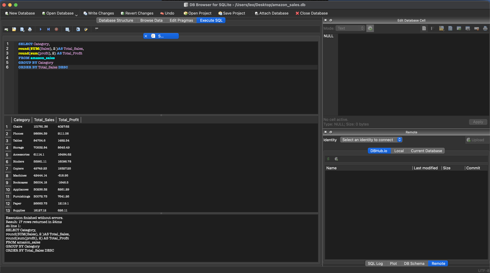

**2. Unprofitable Categories**
Bookcases (-$1,646) and Machines (-$618) are actively losing money despite significant sales volume — a major red flag for any business.

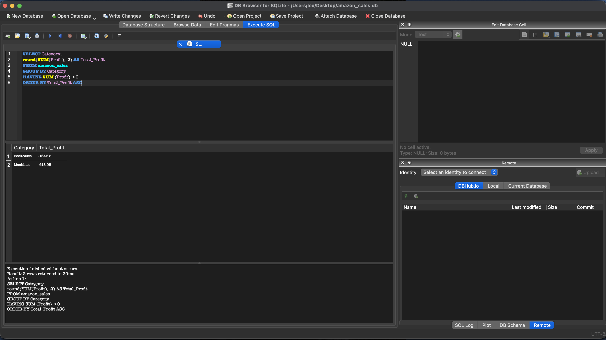

**3. Top 10 Products by Revenue**
Canon imageCLASS 2200 Copier leads at $13,999 in total sales. Office equipment dominates the top 10.

**4. Top Cities by Sales**
Los Angeles ($175K), Seattle ($119K), and San Francisco ($118K) are the top 3 markets. California cities dominate the top 10.

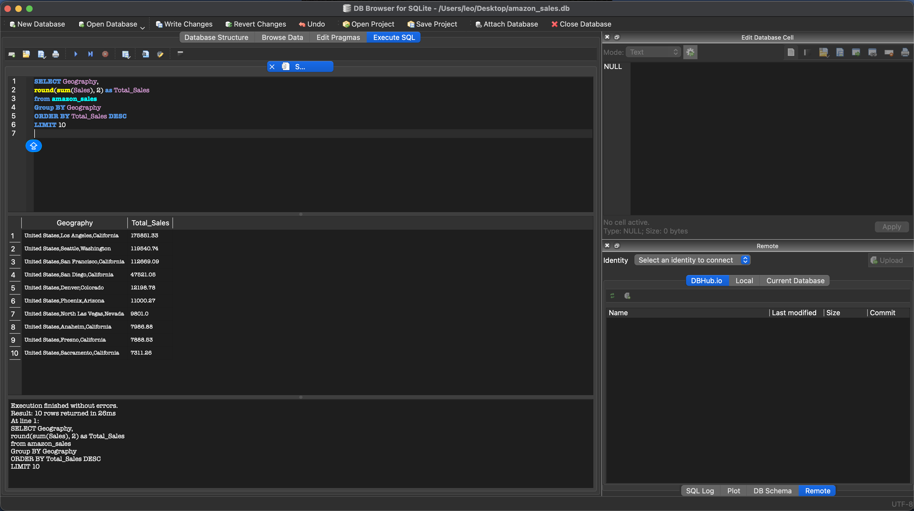

**5. Orders Per Year**
Order volume grew from 661 in 2011 to 1,099 in 2014 — a 66% increase showing strong business growth year over year.

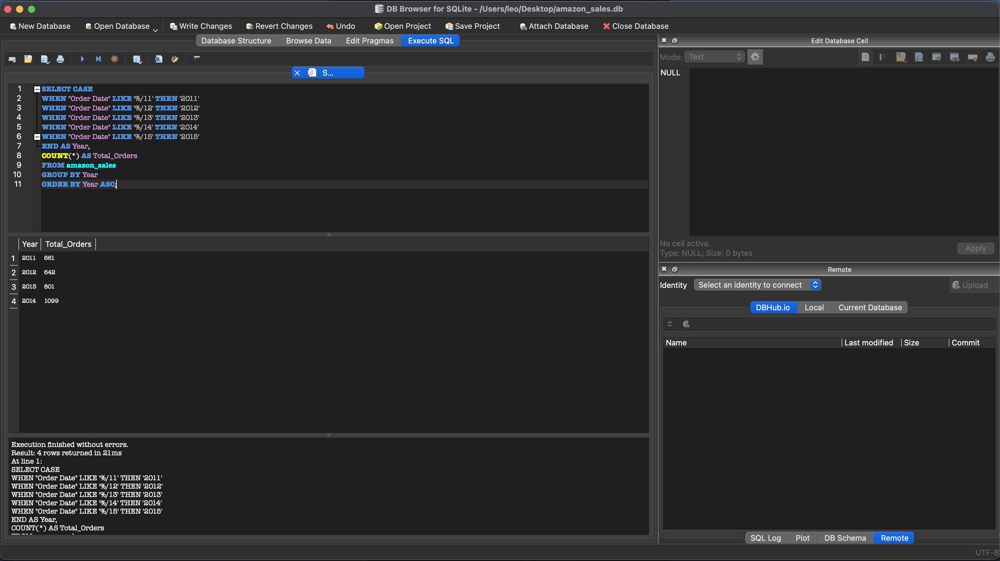

**6. Average Order Value by Category**
Copiers ($1,989) and Machines ($1,088) have the highest average order value — high ticket items driving revenue per transaction.

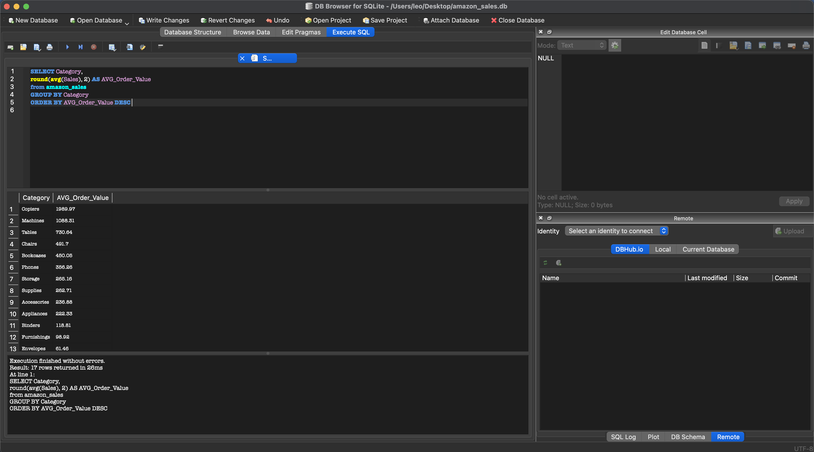

**7. Profit Margin by Category**
Fasteners (29.81%) and Binders (28.76%) are the most efficient categories. Bookcases (-4.57%) and Machines (-1.46%) have negative margins.

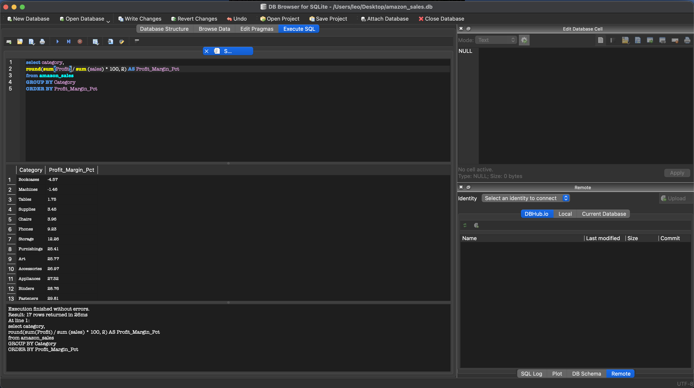

**8. Most Ordered Categories**
Binders (471 orders, 1,868 units) and Paper (450 orders, 1,702 units) are the highest volume categories by transaction count.

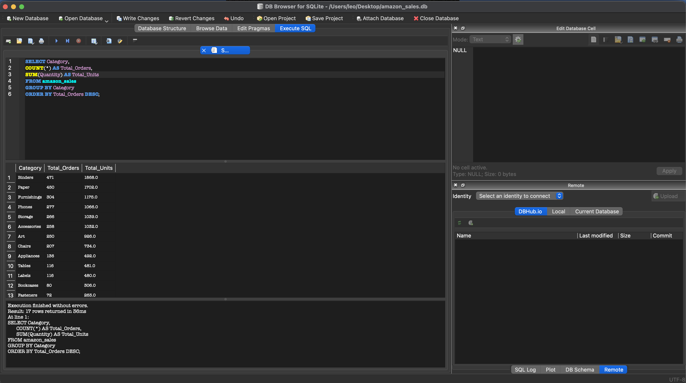

**9. Top 10 Most Profitable Products**
Canon imageCLASS 2200 Copier generates the most profit at $6,719. Canon and Fellowes products dominate the top 10.

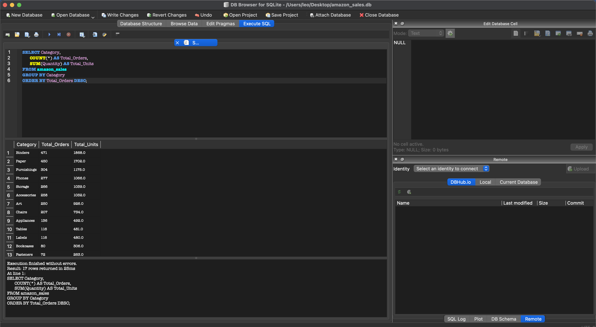

**10. Top Products Above Average Sales**
Using a subquery to identify products exceeding the overall average sales value — Canon imageCLASS leads at $13,999 avg per order.

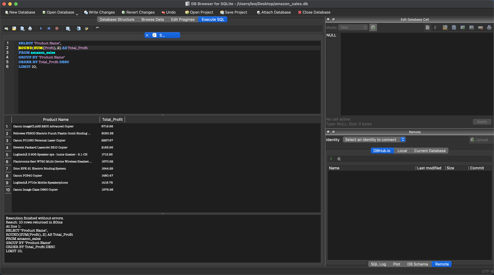

**11. Profitability Label by Category (CASE WHEN)**
15 of 17 categories are profitable. Bookcases and Machines are the only two losing money — actionable insight for inventory decisions.

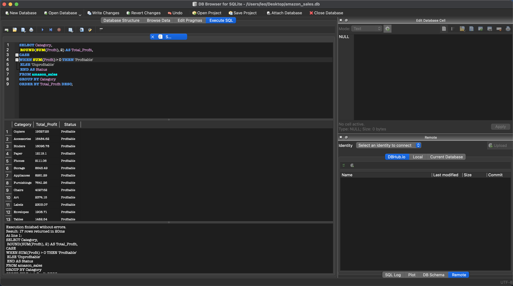

**12. Products Above Average Order Value (Subquery)**
Canon imageCLASS 2200 ($13,999) and High Speed Electric Letter Opener ($6,550) far exceed the store average — premium products driving outsized revenue.

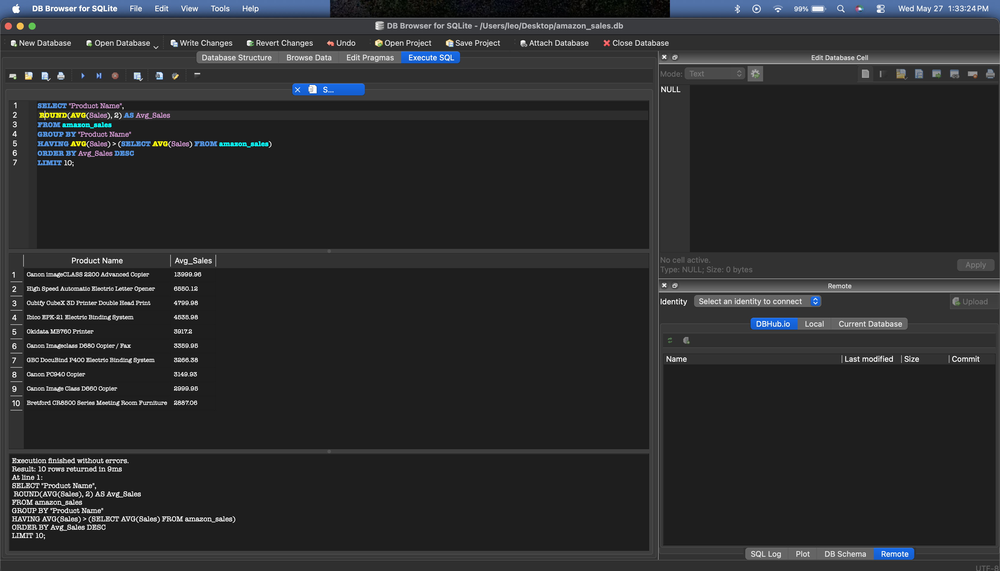

**13. City Profitability Status (CASE WHEN + Geography)**
Los Angeles leads with $30K profit. All top 15 cities by revenue are profitable, confirming strong geographic market performance.

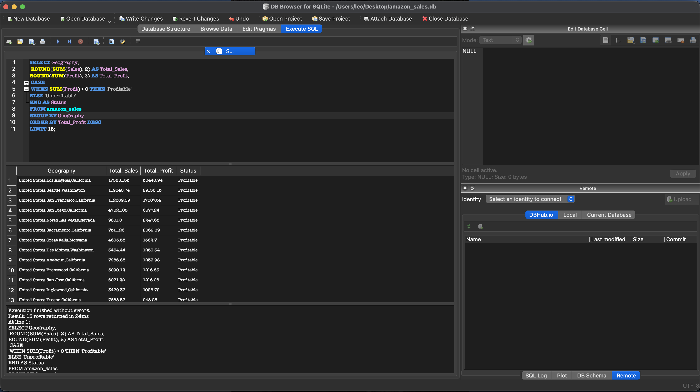

## 📊 SQL Concepts Demonstrated
- `GROUP BY` / `ORDER BY` / `LIMIT`
- `HAVING` for post-aggregation filtering
- `ROUND()`, `SUM()`, `AVG()`, `COUNT()`
- `CASE WHEN` for conditional logic
- Subqueries for dynamic comparisons
- `LIKE` for pattern matching on dates
